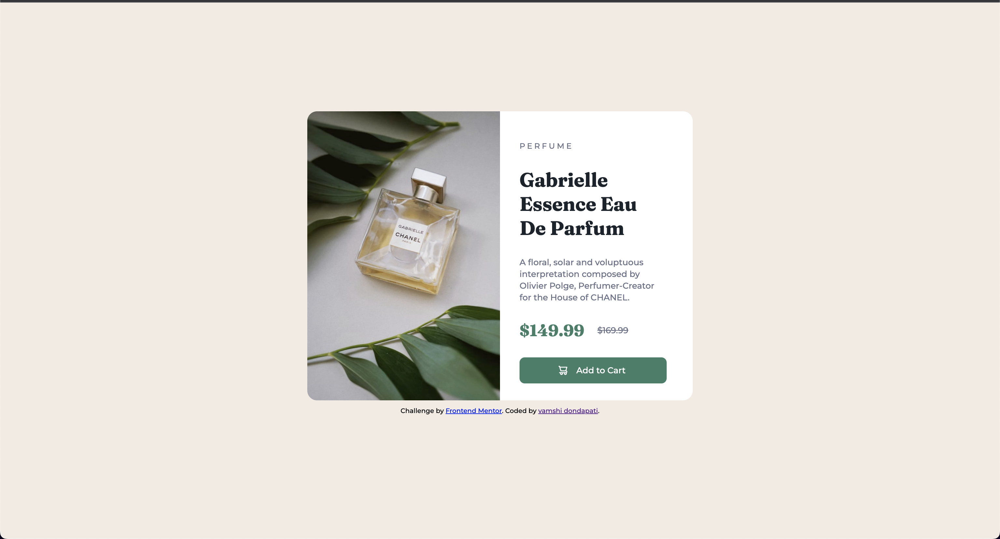
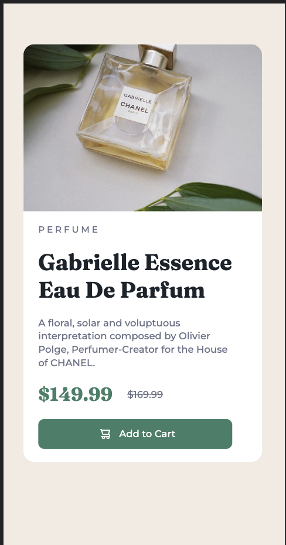

# Frontend Mentor - Product preview card component solution

This is a solution to the [Product preview card component challenge on Frontend Mentor](https://www.frontendmentor.io/challenges/product-preview-card-component-GO7UmttRfa). Frontend Mentor challenges help you improve your coding skills by building realistic projects. 

## Table of contents

- [Overview](#overview)
  - [The challenge](#the-challenge)
  - [Screenshot](#screenshot)
  - [Links](#links)
- [My process](#my-process)
  - [Built with](#built-with)
  - [What I learned](#what-i-learned)
  - [Continued development](#continued-development)
- [Author](#author)

## Overview

### The challenge

Users should be able to:

- View the optimal layout depending on their device's screen size
- See hover and focus states for interactive elements

### Screenshot

### Links

- Solution URL: [Add solution URL here](https://github.com/venkatvamshi/product-preview-card)
- Live Site URL: [Add live site URL here](todo)

## My process

### Built with

- Semantic HTML5 markup
- CSS custom properties
- Flexbox

### What I learned
1. How to use <picture> tag and  tag
2. Height wise responsiveness
3. Use of rem, em, vw, vh and px
4. :hover method in css

### Continued development

Need to understand the use of rem, em, vw, vh and px better.

## Author

- Website - [vamshi dondapati](https://github.com/venkatvamshi)
- Frontend Mentor - [@venkatvamshi](https://www.frontendmentor.io/profile/venkatvamshi)
- LinkedIn - [@vamshi-dondapati-a1b891a3](https://www.linkedin.com/in/vamshi-dondapati-a1b891a3)
